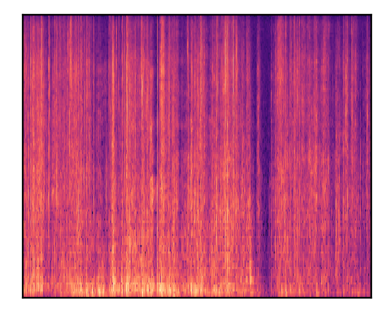

# 
 Diffsound: Discrete Diffusion Model for Text-to-sound Generation 

 Dongchao Yang1, Jianwei Yu2, Helin Wang1, Wen Wang1, Chao Weng2, Yuexian Zou1 Dong Yu2 
 
 

 1 Peking University 

 2 Tencent AI Lab

## Introduction
This is a [demo](https://github.com/yangdongchao/text-to-sound-synthesis-demo/) for our paper **_Diffsound: Discrete Diffusion Model for Text-to-sound Generation_**. Code and Pre-trained model can be found on [github](https://github.com/yangdongchao/Text-to-sound-Synthesis). In the following, we will show some generated samples by our proposed method. If you want to find more samples, please refer to our [github](https://github.com/yangdongchao/Text-to-sound-Synthesis).

## Examples

### The comprarison between generated sample by AR and Diffsound models and real sound

| 
Text description
 | 
AR models
 | 
Diffsound models
 |
Real samples
|
| :--- | :--- | :--- |
|Birds and insects make noise during the daytime|<audio src="1/YsxIvBMSavMQ_mel_sample_5.wav" controls preload></audio>|<audio src="Birds/YsxIvBMSavMQ_mel_sample_3.wav" controls preload></audio>|<audio src="samples1/YsxIvBMSavMQ.wav" controls preload></audio>|
|Mel-spectrograms||||
|A dog barks and whimpers|<audio src="2/YsYj4hpDUZDQ_mel_sample_0.wav" controls preload></audio>|<audio src="dogbarks/YsShpyu2l4YQ_mel_sample_4.wav" controls preload></audio>|<audio src="samples1/YsShpyu2l4YQ.wav" controls preload></audio>|
|Mel-spectrograms||||
|A person is snoring while sleeping|<audio src="3/Yt8tv5YRMJUg_mel_sample_8.wav" controls preload></audio>|<audio src="snoring/YvJrjSeP17yE_mel_sample_0.wav" controls preload></audio>|<audio src="samples1/YsLkeqCDJIyw.wav" controls preload></audio>|
|Mel-spectrograms||||

### Other generated samples by Diffsound model
* **Sample 1**
    * **Text input:**
    _Someone playing drums_
    * **Generated sound**
    <audio src="drums/playdrums_mel_sample_1.wav" controls="controls">ERROR</audio>
---
* **Sample 2**
    * **Text input:**
    _An engine idles consistently before sputtering some_
    * **Generated sound**
    <audio src="engine/YrwT__ERCUno_mel_sample_1.wav" controls="controls">ERROR</audio>
---
* **Sample 3**
    * **Text input:**
    _A train horn sounds and railroad crossing ring_
    * **Generated sound 1**
    <audio src="demo1/Ys7knHCFW82w_mel_sample_4.wav" controls="controls">ERROR</audio>
    * **Generated sound 2**
    <audio src="trainhorn/YzU-oKUEckKo_mel_sample_7.wav" controls="controls">ERROR</audio>
---
* **Sample 4**
    * **Text input:**
    _A clock ticktocks continuously_
    * **Generated sound**
    <audio src="samples1/YsCeWURVHfOM_mel_sample_5.wav" controls="controls">ERROR</audio>
---
* **Sample 5**
    * **Text input:**
    _Some knocking and rubbing_
    * **Generated sound1**
    <audio src="knock/knocking_mel_sample_2.wav" controls="controls">ERROR</audio>
    * **Generated sound2**
    <audio src="knock/knocking_mel_sample_3.wav" controls="controls">ERROR</audio>
---
* **Sample 6**
    * **Text input:**
    _Large explosions sound_
    * **Generated sound1**
    <audio src="explosion/explosions_mel_sample_6.wav" controls="controls">ERROR</audio>
    * **Generated sound2**
    <audio src="explosion/explosions_mel_sample_7.wav" controls="controls">ERROR</audio>
---
* **Sample 7**
    * **Text input:**
    _An engine runs loudly_
    * **Generated sound**
    <audio src="selected/YsZvwOuuPGP0_mel_sample_8.wav" controls="controls">ERROR</audio>
---
* **Sample 8**
    * **Text input:**
    _Birds chirp and pigeons vocalize as a vehicle passes by_
    * **Generated sound1**
    <audio src="selected/YtH-q8LXgHEc_mel_sample_0.wav" controls="controls">ERROR</audio>
     * **Generated sound2**
    <audio src="selected/YtH-q8LXgHEc_mel_sample_5.wav" controls="controls">ERROR</audio>
---
* **Sample 9**
    * **Text input:**
    _A bug is buzzing as it is flying around_
    * **Generated sound**
    <audio src="selected/Yt97k0cejSQE_mel_sample_2.wav" controls="controls">ERROR</audio>
---
* **Sample 10**
    * **Text input:**
    _A person is whistling a tune_
    * **Generated sound1**
    <audio src="whistling/Yw2htir_si7g_mel_sample_3.wav" controls="controls">ERROR</audio>
    * **Generated sound2**
    <audio src="whistling/Yw2htir_si7g_mel_sample_6.wav" controls="controls">ERROR</audio>
    * **Generated sound3**
    <audio src="whistling/Yw2htir_si7g_mel_sample_7.wav" controls="controls">ERROR</audio>
---
* **Sample 11**
    * **Text input:**
    _Thunder roars as rain falls onto a hard surface_
    * **Generated sound1**
    <audio src="Thunder/Ytcd9QCdjTI0_mel_sample_9.wav" controls="controls">ERROR</audio>
    * **Generated sound2**
    <audio src="selected/Ytcd9QCdjTI0_mel_sample_1.wav" controls="controls">ERROR</audio>
---
* **Sample 12**
    * **Text input:**
    _An audience gives applause then a man speaks_
    * **Generated sound**
    <audio src="selected/YtDlfY3nmx1A_mel_sample_4.wav" controls="controls">ERROR</audio>
---
* **Sample 13**
    * **Text input:**
    _Birds chirp and animals make noise_
    * **Generated sound**
    <audio src="selected/YtDlysoZiA1I_mel_sample_4.wav" controls="controls">ERROR</audio>
---
* **Sample 14**
    * **Text input:**
    _A man talks while something sizzles_
    * **Generated sound**
    <audio src="selected/YtfsmcdXCnRg_mel_sample_0.wav" controls="controls">ERROR</audio>
---
* **Sample 15**
    * **Text input:**
    _Someone is typing on a computer keyboard_
    * **Generated sound1**
    <audio src="s2/Ywob-3S4VjMs_mel_sample_0.wav" controls="controls">ERROR</audio>
---
## Links

[[Paper](https://arxiv.org/pdf/2207.09983v1.pdf)] [[Bibtex]()] [[Demo GitHub](https://github.com/yangdongchao/text-to-sound-synthesis-demo)] [[TencentAILab](https://ai.tencent.com/ailab/zh/index)] [[PKU](https://www.pku.edu.cn/)] [[code](https://github.com/yangdongchao/Text-to-sound-Synthesis)]

