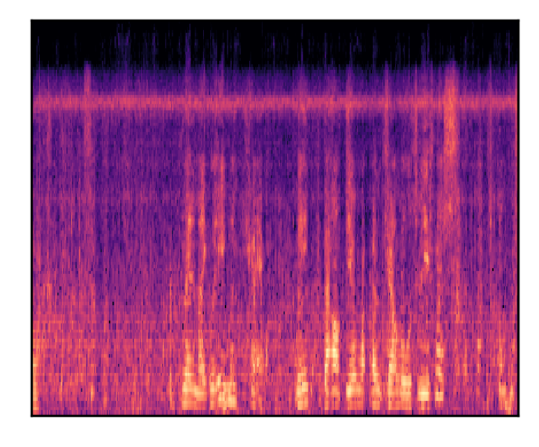

# 
 Text-to-sound Synthesis 

 Dongchao Yang1, Jianwei Yu2, Wen Wang1, Chao Weng2, Yuexian Zou1 
 
 

 1 Peking University 

 2 Tencent AI Lab

## Introduction
This is a [demo](https://github.com/yangdongchao/text-to-sound-synthesis-demo/) for our paper **_Text-to-sound Synthesis_**. Code and Pre-trained model can be found on [github](https://github.com/yangdongchao/Text-to-sound-Synthesis). In the following, we will show some generated samples by our proposed method. If you want to find more samples, please refer to our [github](https://github.com/yangdongchao/Text-to-sound-Synthesis).

## Examples

### The comprarison between generated and real audios

| 
Text description
 | 
generated samples
 | 
Original samples
|
| :--- | :--- | :--- |
|A person is snoring while sleeping|<audio src="samples1/YsLkeqCDJIyw_mel_sample_1.wav" controls preload></audio>|<audio src="samples1/YsLkeqCDJIyw.wav" controls preload></audio>|
|Mel-spectrograms|||
|A man speaks as crickets sing|<audio src="samples1/YryFDPxgDOGc_mel_sample_0.wav" controls preload></audio>|<audio src="samples1/YryFDPxgDOGc.wav" controls preload></audio>|
|Mel-spectrograms|||
|Birds and insects make noise during the daytime|<audio src="samples1/Yvms5XGTDVQc_mel_sample_0.wav" controls preload></audio>|<audio src="samples1/Yvms5XGTDVQc.wav" controls preload></audio>|
|Mel-spectrograms|||
|A dog barks and whimpers|<audio src="samples1/YsShpyu2l4YQ_mel_sample_9.wav" controls preload></audio>|<audio src="samples1/YsShpyu2l4YQ.wav" controls preload></audio>|
|Mel-spectrograms|||

### Other generated samples
* **Sample 1**
    * **Text input:**
    _An engine idles consistently before sputtering some_
    * **Generated sound**
    <audio src="demo1/YrwT__ERCUno_mel_sample_0.wav" controls="controls">ERROR</audio>
---
* **Sample 2**
    * **Text input:**
    _A train horn sounds and railroad crossing ring_
    * **Generated sound 1**
    <audio src="demo1/Ys7knHCFW82w_mel_sample_4.wav" controls="controls">ERROR</audio>
    * **Generated sound 2**
    <audio src="demo1/Ys7knHCFW82w_mel_sample_9.wav" controls="controls">ERROR</audio>
---
* **Sample 3**
    * **Text input:**
    _A clock ticktocks continuously_
    * **Generated sound**
    <audio src="samples1/YsCeWURVHfOM_mel_sample_5.wav" controls="controls">ERROR</audio>
---
* **Sample 4**
    * **Text input:**
    _A vehicle accelerates squealing tires_
    * **Generated sound**
    <audio src="samples1/Ysd7x_Vssqlw_mel_sample_9.wav" controls="controls">ERROR</audio>
---
* **Sample 5**
    * **Text input:**
    _A man speaks, followed by an electronic beep and another man speaking_
    * **Generated sound**
    <audio src="samples1/YsG7TyPnFDR0_mel_sample_4.wav" controls="controls">ERROR</audio>
---
* **Sample 6**
    * **Text input:**
    _A baby screams and cries_
    * **Generated sound**
    <audio src="selected/YsYQi1wgCNu4_mel_sample_7.wav" controls="controls">ERROR</audio>
---
* **Sample 7**
    * **Text input:**
    _An engine runs loudly_
    * **Generated sound**
    <audio src="selected/YsZvwOuuPGP0_mel_sample_8.wav" controls="controls">ERROR</audio>
---
* **Sample 8**
    * **Text input:**
    _Birds chirp and pigeons vocalize as a vehicle passes by_
    * **Generated sound1**
    <audio src="selected/YtH-q8LXgHEc_mel_sample_0.wav" controls="controls">ERROR</audio>
     * **Generated sound2**
    <audio src="selected/YtH-q8LXgHEc_mel_sample_5.wav" controls="controls">ERROR</audio>
---
* **Sample 9**
    * **Text input:**
    _A bug is buzzing as it is flying around_
    * **Generated sound**
    <audio src="selected/Yt97k0cejSQE_mel_sample_2.wav" controls="controls">ERROR</audio>
---
* **Sample 10**
    * **Text input:**
    _Soft whistling with wind blowing_
    * **Generated sound**
    <audio src="selected/YtbLjCaI0-Lo_mel_sample_6.wav" controls="controls">ERROR</audio>
---
* **Sample 11**
    * **Text input:**
    _Thunder roars as rain falls onto a hard surface_
    * **Generated sound1**
    <audio src="selected/Ytcd9QCdjTI0_mel_sample_0.wav" controls="controls">ERROR</audio>
    * **Generated sound2**
    <audio src="selected/Ytcd9QCdjTI0_mel_sample_1.wav" controls="controls">ERROR</audio>
---
* **Sample 12**
    * **Text input:**
    _An audience gives applause then a man laughs and speaks_
    * **Generated sound1**
    <audio src="selected/YtDlfY3nmx1A_mel_sample_4.wav" controls="controls">ERROR</audio>
    * **Generated sound2**
    <audio src="selected/YtDlfY3nmx1A_mel_sample_3.wav" controls="controls">ERROR</audio>
---
* **Sample 13**
    * **Text input:**
    _Birds chirp and animals make noise_
    * **Generated sound1**
    <audio src="selected/YtDlysoZiA1I_mel_sample_6.wav" controls="controls">ERROR</audio>
    * **Generated sound2**
    <audio src="selected/YtDlysoZiA1I_mel_sample_4.wav" controls="controls">ERROR</audio>
---
* **Sample 14**
    * **Text input:**
    _A man talks while something sizzles_
    * **Generated sound1**
    <audio src="selected/YtfsmcdXCnRg_mel_sample_0.wav" controls="controls">ERROR</audio>
    * **Generated sound2**
    <audio src="selected/YtfsmcdXCnRg_mel_sample_9.wav" controls="controls">ERROR</audio>
---
* **Sample 15**
    * **Text input:**
    _Someone is typing on a computer keyboard_
    * **Generated sound1**
    <audio src="s2/Ywob-3S4VjMs_mel_sample_0.wav" controls="controls">ERROR</audio>
---
## Links

[[Paper]()] [[Bibtex]()] [[Demo GitHub](https://github.com/yangdongchao/text-to-sound-synthesis-demo)] [[TencentAILab](https://ai.tencent.com/ailab/zh/index)] [[code](https://github.com/yangdongchao/Text-to-sound-Synthesis)]

